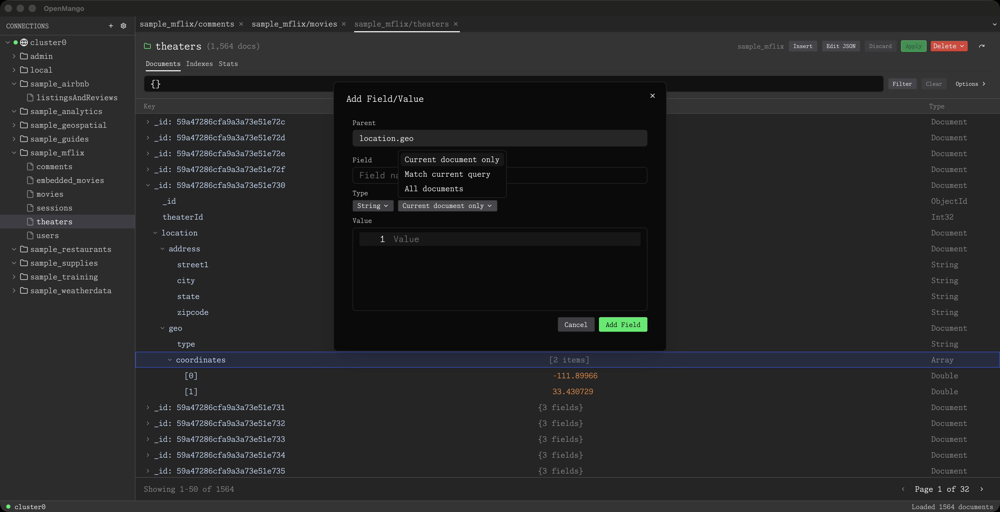

# OpenMango

[](https://github.com/ggagosh/openmango/actions/workflows/ci.yml)
[](https://github.com/ggagosh/openmango/blob/main/LICENSE)


GPU-accelerated MongoDB client for macOS



## Download

**[Latest Release](https://github.com/ggagosh/openmango/releases/latest)** — macOS (Apple Silicon & Intel)

Or build from source (see [Development](#development) below).

## Features

- **Connection manager** — add, edit, test, connect/disconnect with session restore
- **Database browser** — list, create, drop with stats
- **Collection browser** — list, create, drop, rename with stats
- **Document viewer** — filter, sort, projection, pagination
- **Inline editing** — edit fields directly in tree view
- **JSON editor** — full document editing with validation
- **Bulk operations** — insert, duplicate, delete; paste from clipboard (JSON/NDJSON)
- **Index management** — list, create, drop indexes
- **Tabbed workspace** — preview/permanent tabs with full session restore
- **Keyboard shortcuts** — 40+ bindings for power users

See [`docs/features.md`](docs/features.md) for the complete feature matrix.

## Development

**Requirements:** Rust stable, MongoDB instance (local or remote)

```sh
# Run in development mode
just dev

# Build release
just release

# Run tests
cargo test
```

<details>
<summary>Release packaging</summary>

```sh
scripts/release_macos.sh
```

macOS release script supports codesign + notarization when env vars are set.

</details>

## Roadmap

See [`docs/features.md`](docs/features.md) for the detailed roadmap. Upcoming highlights:

- Import/export data and connections
- Aggregation pipeline editor + explain plan
- Query history and saved queries
- Read-only/safe mode
- Theming and keymap customization

## License

GPL-3.0
