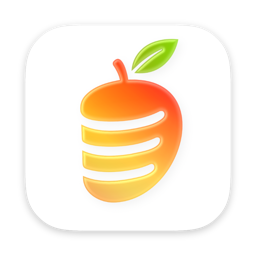
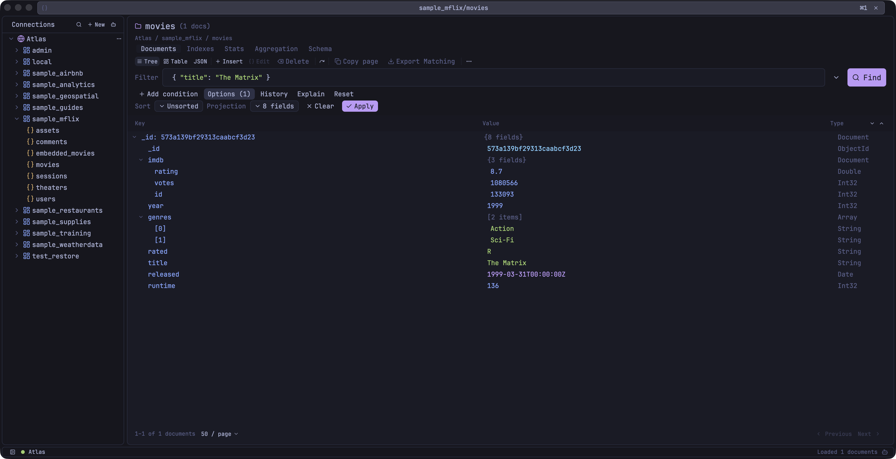
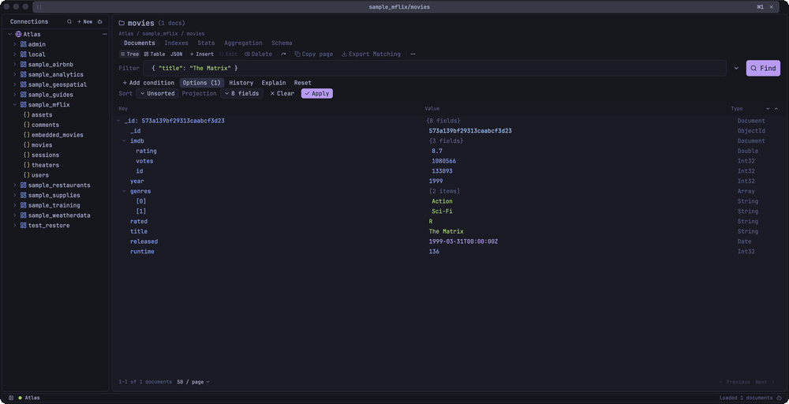

<p align="center">
  
</p>

<h1 align="center">OpenMango</h1>

<p align="center">
  <strong>A native MongoDB workbench for macOS.</strong><br />
  Browse, query, edit, analyze, and move data without Electron or web views.
</p>

<p align="center">
  <a href="https://openmango.app">Website</a> ·
  <a href="https://github.com/ggagosh/openmango/releases/latest">Download</a> ·
  <a href="https://github.com/ggagosh/openmango/releases/tag/nightly">Nightly</a> ·
  <a href="CONTRIBUTING.md">Contribute</a>
</p>

<p align="center">
  <a href="https://github.com/ggagosh/openmango/releases/latest"></a>
  <a href="https://github.com/ggagosh/openmango/actions/workflows/ci.yml"></a>
  <a href="https://github.com/ggagosh/openmango/blob/main/LICENSE"></a>
  
</p>

<p align="center">
  
</p>

## Why OpenMango

OpenMango puts the tools used in day-to-day MongoDB work into one fast, keyboard-friendly desktop app. Its interface is written in Rust with [GPUI](https://gpui.rs) and rendered natively on the GPU—there is no browser runtime between you and your data.

| Area | What you can do |
| --- | --- |
| **Documents** | Browse in tree or table view, filter, sort, project, paginate, edit inline or as JSON, and run guarded bulk operations. |
| **Queries** | Build aggregation pipelines, inspect schemas and explain plans, use mongosh-compatible Forge, and save or restore work from the Query Library. |
| **Data movement** | Import JSON, NDJSON, CSV, or BSON; export those formats plus Excel; copy between collections or databases with progress and cancellation. |
| **Connections** | Use direct or SRV connections, SSH tunnels, and SOCKS5 proxies. Import and export connection profiles in redacted or encrypted form. |
| **AI (optional)** | Ask MongoDB-aware questions with Gemini, OpenAI, Anthropic, or Ollama; review tool calls and control whether document samples are shared. |
| **Workspace** | Restore tabs and connections, use a command palette and keyboard shortcuts, choose from 13 themes, and check for verified updates in-app. |

## Install

1. Open the [latest release](https://github.com/ggagosh/openmango/releases/latest).
2. Download the ZIP for your Mac:
   - `macos-arm64` for Apple Silicon
   - `macos-x86_64` for Intel
3. Unzip it and move `OpenMango.app` to `/Applications`.

Stable builds are signed and notarized. Each release also includes a SHA-256 checksum. OpenMango can download the matching update in the background, verifies its checksum, and installs it only after you choose **Restart and install**.

Want current development builds? Use the [nightly release](https://github.com/ggagosh/openmango/releases/tag/nightly); nightly builds may be unstable.

## Document views

Browse nested BSON in Tree view, then open the complete document as syntax-highlighted Extended JSON.

<details>
  <summary>Compare Tree and JSON views — 6-second loop</summary>

  <p align="center">
    
  </p>
</details>

## Get started

1. Open the connection manager with the **+** button.
2. Add a `mongodb://` or `mongodb+srv://` connection string and test it.
3. Connect, then choose a database and collection from the sidebar.
4. Browse documents or open **Aggregation**, **Schema**, **Explain**, **Forge**, or the **Query Library** for deeper work.

For AI features, open **Settings**, enable AI, and choose a provider. Remote-provider keys can be entered in the app; Ollama is supported without an API key.

## Data safety and privacy

- Connection credentials and AI API keys are stored in macOS Keychain, not in the JSON configuration files.
- Per-connection read-only mode blocks app-owned writes, including writes initiated through AI and Forge.
- Destructive actions use confirmations and revalidate their target before execution.
- Imports, copies, and exports stage their output so failure or cancellation does not silently replace existing data or files.
- AI document sharing is opt-in: selected-document and automatic sample sharing are disabled by default.
- Settings can export a redacted support bundle without connection secrets.

## Architecture

| Layer | Location | Responsibility |
| --- | --- | --- |
| Native UI | `src/app/`, `src/views/`, `src/components/` | GPUI shell, screens, dialogs, editors, and shared controls |
| State and actions | `src/state/` | Workspace state, commands, persistence, query library, and updater |
| MongoDB access | `src/connection/` | Driver operations, transfers, SSH tunnels, SOCKS5 transport, and BSON tools |
| Forge shell | `tools/forge-sidecar/` | Bun/TypeScript sidecar for mongosh-compatible execution and completion |
| Assets and themes | `assets/`, `themes/`, `resources/` | Embedded fonts, icons, themes, and packaged helper binaries |

The main data path is deliberately direct: GPUI views dispatch state commands, commands call the connection layer, and the official Rust MongoDB driver talks to the server. Forge reuses the active connection transport through its compiled sidecar.

## Development

### Prerequisites

- macOS and the stable Rust toolchain
- Xcode 26 or newer for app icon compilation, macOS packaging, and `just ci`
- [just](https://github.com/casey/just)
- [lld](https://lld.llvm.org/) at `/opt/homebrew/opt/lld/bin/ld64.lld` (the repository linker configuration uses this path)
- [Bun](https://bun.sh/) when changing or rebuilding Forge
- Docker for the Testcontainers integration suites
- A local or remote MongoDB deployment for manual testing

### Run locally

```sh
git clone https://github.com/ggagosh/openmango.git
cd openmango
just dev
```

The repository includes the Apple Silicon helper binaries used by normal local development. Rebuild or download them for your host when working on Forge or BSON transfer support:

```sh
just build-sidecar
just download-tools
```

No `.env` file is required. Use `just debug` to start with `RUST_LOG=debug`.

On macOS, the Cargo runner signs development builds with an Apple Development
identity and a stable app-and-team requirement. Unchanged, valid builds are not
signed again. Set `OPENMANGO_DEV_SIGNING_IDENTITY` to a full identity name or SHA-1
to select a different Apple signing identity; the runner stops if no matching
identity is available instead of launching an unsigned app.

Keychain items approved for older unsigned builds or an older certificate may
need one approval for the corrected development signature. Approve the signing
key and each requested OpenMango item with **Always Allow** in the macOS dialogs.
Credentials remain in Keychain; development does not fall back to a plaintext file.

### Common commands

| Command | Purpose |
| --- | --- |
| `just dev` | Run the debug build |
| `just check` | Fast compile check |
| `just fmt-check` | Check Rust formatting |
| `just lint` | Run Clippy with warnings denied |
| `just app-icon` | Compile the native macOS app icon and PNG export |
| `just unit-test` | Run library tests serially |
| `just test` | Run all Rust tests; integration suites require Docker |
| `just ci` | Match the hosted quality job: format, release check, release Clippy, sidecar check, app icon compilation, and unit tests |
| `just precommit` | Run `just ci` followed by the full test suite |

Run one integration suite serially with:

```sh
cargo test --test transfer_tests -- --test-threads=1
```

### Project layout

```text
src/
  app/          Application shell, sidebar, and top-level layout
  state/        State, persistence, and commands
  connection/   MongoDB operations and transports
  views/        Documents, aggregation, Forge, transfer, AI, and settings screens
  components/   Reusable GPUI controls
  models/       Connection and tree models
  helpers/      Validation, Keychain, logging, crypto, and support utilities
tests/          Docker-backed integration suites and shared test helpers
tools/          Forge sidecar source
scripts/        Tool download, packaging, and release scripts
```

See [CONTRIBUTING.md](CONTRIBUTING.md) for coding standards and the pull request checklist. Shipped changes are tracked in [CHANGELOG.md](CHANGELOG.md).

## AI disclosure

OpenMango is human-directed and machine-authored: its architecture, implementation, tests, and tooling were written with AI.

## License

OpenMango is available under the [GNU General Public License v3.0](LICENSE).
