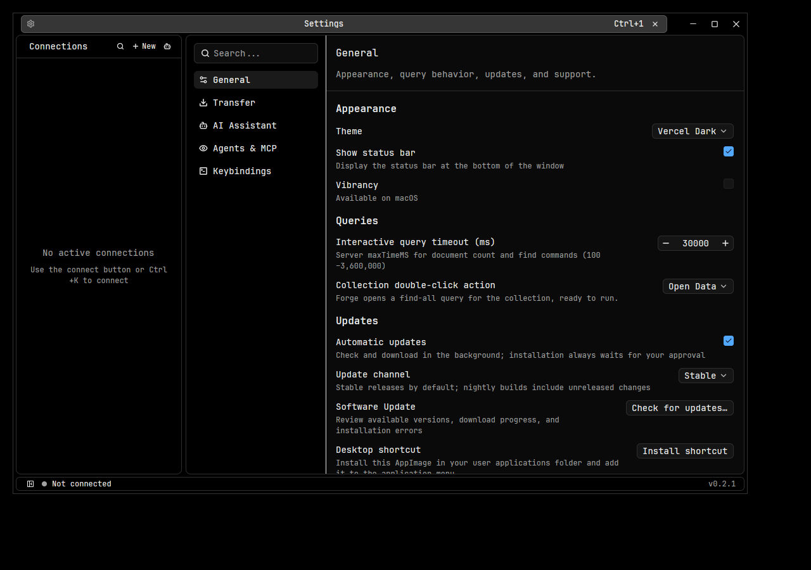

# Linux support

Linux AppImages are built for x86_64 and ARM64 on Ubuntu 24.04 (glibc 2.39).
Pull-request CI produces unsigned previews with checksums and GUI screenshots.
They are for qualification; public releases and automatic updates require the
signing configuration and release checks below.



## Development

Run these commands **inside Linux**. On macOS, an OrbStack Ubuntu machine is
suitable for native ARM64 builds, tests, and software-rendered GUI smoke checks.
It does not establish x86_64, real GPU, GNOME, KDE, or Wayland compatibility.

```sh
bash scripts/setup_linux_dev.sh
export PATH="$HOME/.local/bin:$HOME/.cargo/bin:$PATH"
export CARGO_TARGET_DIR="$HOME/.cache/openmango-target"
export CARGO_BUILD_JOBS=2
export CARGO_HUSKY_DONT_INSTALL_HOOKS=true
export RUSTUP_TOOLCHAIN=1.98.0
bash scripts/build_mongosh_sidecar.sh
bash scripts/download_tools.sh
cargo check --locked --all-targets
cargo clippy --locked --all-targets -- -D warnings
cargo test --locked --lib -- --test-threads=1
```

Use a separate Linux target directory when sharing the checkout with macOS. Allow
at least 8 GB RAM for builds; one job reduces parallel memory use. The initial
3 GB OrbStack environment ran out of memory compiling the application test binary.
Integration suites additionally require Docker and use disposable MongoDB fixtures.

On an ordinary graphical desktop, `cargo run` launches the app. Standard desktop
services are required: a session D-Bus, a working Secret Service keyring (for
example GNOME Keyring), file-dialog portals, and working GPU drivers. Credentials
do not fall back to plaintext when a keyring is unavailable. Vibrancy is macOS-only.

## Build and install an AppImage

```sh
bash scripts/release_linux.sh
bash scripts/check_linux_package.sh dist/OpenMango-*-linux-*.AppImage
chmod +x dist/OpenMango-*-linux-*.AppImage
```

For packaged database and GUI checks (Docker and `bootstrap_linux.sh --desktop-tests`
dependencies required):

```sh
bash scripts/check_linux_package.sh dist/OpenMango-*-linux-*.AppImage --database-tests
python3 scripts/check_linux_gui.py dist/OpenMango-*-linux-*.AppImage target/linux-gui.png
OPENMANGO_GUI_WINDOW_MANAGER=xfwm4 python3 scripts/check_linux_gui.py dist/OpenMango-*-linux-*.AppImage target/linux-gui-xfce.png
```

These use disposable MongoDB containers and a private X11/D-Bus session with
temporary configuration, application data, and keyring storage. The GUI check
retains a screenshot and log under `target/`.

Package on the same CPU architecture as the target. The image includes the GUI,
Forge's compiled Bun sidecar, mongodump, and mongorestore. No separate Bun, Node,
mongosh, or MongoDB tools installation is required to use the packaged app.

Launch the image directly. If FUSE is unavailable, use the runtime's extraction mode:

```sh
APPIMAGE_EXTRACT_AND_RUN=1 ./OpenMango-0.2.1-linux-arm64.AppImage
```

Use the filename for your version and architecture. Choose **Settings → Updates →
Install shortcut**, or run the image with `--install-desktop`, to copy it to
`$XDG_DATA_HOME/openmango/OpenMango.AppImage` and register its icon and desktop entry.
`XDG_DATA_HOME` defaults to `~/.local/share`. An existing different installation is
never overwritten by this action. Launch the registered copy for future updates.
If you install while using extraction mode, the desktop shortcut preserves that
mode for later launches, including when FUSE is unavailable.

To uninstall the shortcut, remove the AppImage in `openmango/`,
`applications/com.openmango.app.desktop`, and
`icons/hicolor/256x256/apps/com.openmango.app.png` under the same data directory.
Settings, credentials, and history are retained.

## Updates and release configuration

The existing stable/nightly selector verifies signed JSON metadata before accepting
an AppImage. The signature binds channel, architecture, version, commit, filename,
size, and SHA-256. Installation stages the verified image beside the current one,
holds a per-installation lock, and keeps a backup until the new app acknowledges
its first rendered frame. Startup failure terminates the replacement's process
group (including the AppImage launcher and its child) before restoring the old image.

Self-updates require a user-owned AppImage, a writable installation directory,
and a filesystem supporting hard links for the atomic replacement backup.
Source builds and unsigned local previews have no trusted release key and do not
self-update. Root-owned or package-managed installations require manual updates.

After qualification, maintainers configure:

- Repository variable `LINUX_UPDATE_PUBLIC_KEY`: the base64 Minisign public-key line.
  It is compiled into release binaries as `OPENMANGO_LINUX_UPDATE_PUBLIC_KEY`.
- Repository secret `LINUX_SIGNING_KEY`: an unencrypted Minisign secret key for
  noninteractive signing. Keep the original key and recovery copy outside the repo.
- Repository variable `LINUX_RELEASES_ENABLED=true`: enables both architectures in
  stable and nightly publication. Leave unset until the release gate passes.

The signing workflow requires both keys, signs the exact metadata bytes, verifies
its own output, and removes its temporary secret-key file. Local packaging without
keys produces a clearly marked unsigned preview. Do not publish that preview as
an authenticated update or use the regression fixture's public key for releases.

## Pinned build tools

| Component | Version | Source |
| --- | --- | --- |
| MongoDB Database Tools | 100.14.1 | [Publisher manifest](https://downloads.mongodb.org/tools/db/full.json) |
| Bun | 1.4.2 | [Release](https://github.com/oven-sh/bun/releases/tag/bun-v1.4.2) |
| linuxdeploy | 1-alpha-20251107-1 | [Release](https://github.com/linuxdeploy/linuxdeploy/releases/tag/1-alpha-20251107-1) |
| appimagetool | 1.9.1 | [Release](https://github.com/AppImage/appimagetool/releases/tag/1.9.1) |
| AppImage type-2 runtime | 20251108 | [Source and build recipe](https://github.com/AppImage/type2-runtime/tree/20251108) |
| minisign-verify | 0.2.5 | [Verifier source](https://github.com/jedisct1/rust-minisign-verify/tree/0.2.5) |

Archive hashes are pinned in the scripts and checked before extraction or execution.
The AppImage runtime is supplied explicitly to appimagetool. Bun's compiled sidecar
is copied after linuxdeploy: rewriting its ELF file breaks the embedded payload.
The package includes upstream licenses for these runtimes, MongoDB's notices, and
licenses collected by linuxdeploy for bundled system libraries.

## Validation and release qualification

Local Ubuntu 26.04 ARM64 validation covers compile/Clippy, unit and integration
suites, the complete AppImage, bundled Forge and BSON transfers, desktop-entry
launching, history-key persistence, and quit/reopen. GUI checks use isolated
Xvfb sessions with Openbox and Xfwm; Xfwm checks that tabs and Kit window controls
share one header. These software-rendered tests do not establish real GPU or
Wayland compatibility.

Before public Linux releases:

- Complete native Ubuntu 24.04 CI and downloaded-artifact checks on both architectures.
- Qualify GNOME X11/Wayland and KDE Wayland: window controls, scaling, clipboard,
  IME, file dialogs, detached editors, suspend/resume, and workspace restore.
- Test saved credentials with unlocked, locked, and missing keyring services.
- Exercise two signed builds through stable/nightly selection, update, restart,
  workspace restore, cancellation, corruption, invalid signatures, read-only
  destinations, concurrent installs, and unsaved-work cancellation.
- Finish source/relink distribution material for statically linked LGPL components
  in Bun and the AppImage runtime. The runtime's MIT wrapper license is not its
  complete license inventory; some upstream build inputs are unversioned Alpine packages.
- Download and test published artifacts before advertising macOS feature parity.
