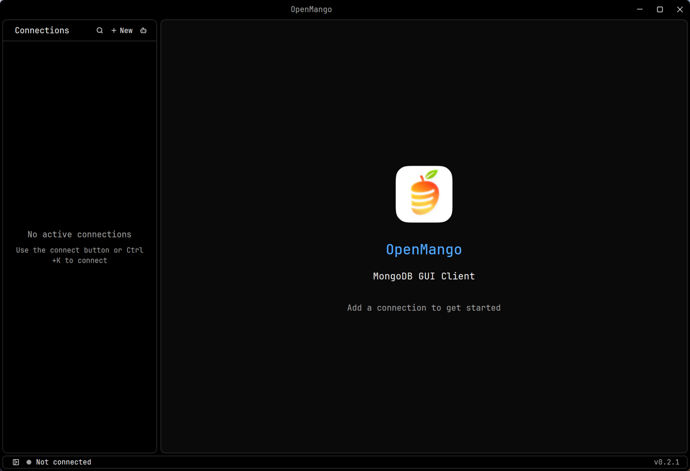

# Windows support

Windows installers are built for x64 and ARM64 on Windows 10 and 11.
Pull-request CI produces unsigned previews with checksums. They are for
qualification; public releases and automatic updates require the release
configuration and checks below.



## Development

Run the toolchain setup once in an **administrator** PowerShell. It installs Git,
Visual Studio Build Tools with the Windows SDK, Rust, Strawberry Perl, CMake,
LLVM, NASM, Python, and Bun 1.4.2, and enables long paths:

```powershell
powershell -ExecutionPolicy Bypass -File scripts\setup_windows_dev.ps1
```

Then work in **Git Bash** from a new terminal:

```sh
# Vendored OpenSSL needs a complete perl; Git Bash's perl fails to configure it.
export OPENSSL_SRC_PERL='C:\Strawberry\perl\bin\perl.exe'
bash scripts/build_mongosh_sidecar.sh
bash scripts/download_tools.sh
cargo clippy --locked --all-targets -- -D warnings
cargo test --locked --lib -- --test-threads=1
cargo run
```

Allow 8 GB RAM or more. A cold debug build takes about 16 minutes on 6 ARM64 cores.
Excluding the checkout and `%USERPROFILE%\.cargo` from Microsoft Defender scanning
makes builds noticeably faster; that is optional and a machine-wide security choice.

Debug builds keep a console window for logs and log
`The application requested an operation that depends on an SDK component that is missing`
(`0x887A002D`) at startup: GPUI requests the Direct3D debug layer, which is an optional
Windows feature. Rendering continues normally. Install the feature to silence it:
`Add-WindowsCapability -Online -Name Tools.Graphics.DirectX~~~~0.0.1.0`.
Release builds are GUI applications with no console window.

On macOS, a Windows 11 ARM64 virtual machine (for example VMware Fusion) is suitable
for native ARM64 builds, installer checks, and GUI testing with GPU acceleration.
It does not establish x64 hardware compatibility; CI covers x64 natively.

## Build and install the installer

```sh
bash scripts/release_windows.sh
bash scripts/check_windows_package.sh dist/OpenMango-*-windows-*-setup.exe --launch
```

The release script downloads a pinned, checksum-verified Inno Setup compiler into the
target directory on first use. The check installs silently into a temporary folder with
a non-ASCII path, runs the app and bundled tools, checks the Forge protocol, and uninstalls,
including after a failed check. It refuses to run while OpenMango is installed for the current
user, because installs share one registration. `--launch` also keeps the installed app open for 15 seconds;
it needs a desktop session, so it fails over SSH, where Direct3D is unavailable (`0x887A0022`).

Package on the same CPU architecture as the target. The installer contains the GUI,
Forge's compiled Bun sidecar, mongodump, mongorestore, and licenses. MongoDB publishes
x64 database tools only; ARM64 installers include them and Windows 11 runs them under
emulation. The app itself is native ARM64.

The installer is per user and needs no administrator rights. It installs to
`%LOCALAPPDATA%\Programs\OpenMango`, adds a Start menu entry and an optional desktop
shortcut, and registers an uninstaller in **Settings → Apps**. Uninstalling keeps
settings (`%APPDATA%\openmango`), logs (`%LOCALAPPDATA%\com.openmango.app\logs`), and
credentials, which are stored in Windows Credential Manager.

Installers are not Authenticode-signed yet, so Windows SmartScreen shows
"Windows protected your PC" on first run; choose **More info → Run anyway**.

## Updates and release configuration

Windows uses the same signed metadata as Linux: one Minisign signature binds channel,
architecture, version, commit, installer filename, size, and SHA-256. The app verifies
the downloaded installer against it, stages a re-verified copy, and quits. A hidden
PowerShell step waits for OpenMango to exit, runs the installer silently with a
progress window, and reopens the app.

Automatic updates require an installer-managed copy (the uninstaller beside
`OpenMango.exe`) and a build with the update key compiled in. Development builds
and copied executables do not self-update. If an installation fails, the previous
version reopens and `install.log` stays in `%TEMP%\openmango-update-*`.

The Windows workflows reuse the Linux signing configuration:

- Repository variable `LINUX_UPDATE_PUBLIC_KEY`, compiled into release binaries as
  `OPENMANGO_UPDATE_PUBLIC_KEY`.
- Repository secret `LINUX_SIGNING_KEY`, used by the Ubuntu signing job.
- Repository variable `WINDOWS_RELEASES_ENABLED=true`: enables both Windows
  architectures in stable and nightly publication. Leave unset until the release
  gate passes.

## Pinned build tools

| Component | Version | Source |
| --- | --- | --- |
| MongoDB Database Tools | 100.14.1 | [Publisher manifest](https://downloads.mongodb.org/tools/db/full.json) |
| Bun | 1.4.2 | [Release](https://github.com/oven-sh/bun/releases/tag/bun-v1.4.2) |
| Inno Setup | 7.1.0 | [Release](https://github.com/jrsoftware/issrc/releases/tag/is-7_1_0) |
| minisign-verify | 0.2.5 | [Verifier source](https://github.com/jedisct1/rust-minisign-verify/tree/0.2.5) |

Archive hashes are pinned in the scripts and checked before extraction or execution.
The C runtime is linked statically, so the app does not require the Visual C++
redistributable.

## Validation and release qualification

Local Windows 11 ARM64 validation (VMware Fusion) covers Clippy, unit tests, the complete
installer, installation into a non-ASCII path, bundled tool startup, the Forge protocol,
uninstall, the static C runtime (only Windows system DLLs are imported), launch without a
console window, and the update handoff: a successful silent reinstall that reopens the app
and removes its staging folder, and a failed one that reopens the previous version and keeps it.
Windows CI runs the installer checks natively on x64 and ARM64. Integration suites need
Linux containers and run on the Linux CI job.

Before public Windows releases:

- Complete x64 and ARM64 CI and downloaded-installer checks on clean machines.
- Qualify Windows 10 and 11 at 100%, 150%, and 200% scaling: window controls, snap
  layouts, clipboard, IME, file dialogs, detached editors, sleep/resume, and workspace restore.
- Test saved credentials, SSH tunnels, BSON export and import, and Forge queries against real deployments.
- Exercise two signed builds through stable/nightly selection, update, restart,
  unsaved-work cancellation, a failed installation, and an invalid signature.
- Sign installers and executables with Authenticode to remove the SmartScreen warning.
- Download and test published artifacts before advertising Windows support.
